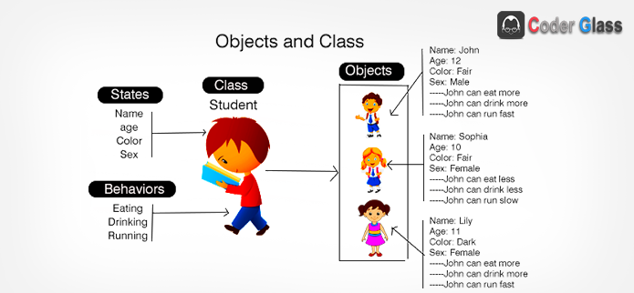

# Fundamentos de programação Orientada a Objetos com Java

## Índice

- [Fundamentos de programação Orientada a Objetos com Java](#fundamentos-de-programação-orientada-a-objetos-com-java)
	- [Índice](#índice)
	- [Antes de começar](#antes-de-começar)
	- [Introdução](#introdução)
		- [Pré requisitos](#pré-requisitos)
		- [Assuntos abordados](#assuntos-abordados)
	- [Conceito de POO](#conceito-de-poo)
	- [Classes](#classes)
		- [A estrutura das classes Java](#a-estrutura-das-classes-java)
		- [Convenções de classes](#convenções-de-classes)
	- [Pacotes](#pacotes)
		- [Convenção: Nomenclatura](#convenção-nomenclatura)
		- [Identificação](#identificação)
		- [Package versus import](#package-versus-import)
		- [Exemplo prático via Eclipse](#exemplo-prático-via-eclipse)
		- [Link de referência aula completa](#link-de-referência-aula-completa)
	- [Visibilidade dos recursos](#visibilidade-dos-recursos)
		- [Modificador public](#modificador-public)
		- [Modificador default](#modificador-default)
		- [Modificador privado](#modificador-privado)
		- [Link de referência da aula completa](#link-de-referência-da-aula-completa)
	- [Getters e Setters](#getters-e-setters)
		- [Link de referência da aula completa](#link-de-referência-da-aula-completa-1)
	- [Construtores](#construtores)
		- [Link de referência da aula completa](#link-de-referência-da-aula-completa-2)
	- [Enums](#enums)
		- [Link de referência da aula completa](#link-de-referência-da-aula-completa-3)
	- [UML](#uml)
		- [Associação](#associação)
		- [Multiplicidade](#multiplicidade)
		- [Visibilidade](#visibilidade)
		- [Para praticar](#para-praticar)
		- [Link de referência da aula completa](#link-de-referência-da-aula-completa-4)
	- [Links e materiais adicionais](#links-e-materiais-adicionais)
	- [Tarefas adicionais](#tarefas-adicionais)

## Antes de começar

- [x]  Criar pasta referente ao curso
- [x]  Adicionar link da pasta nos atributos do curso

## Introdução

### Pré requisitos

Como pré requisitos para o curso temos que ter o **JDK instalado**, a **IDE Eclipse** foi escolhida para ser apresentada e precisamos ter uma noção de **sintaxe Java.**

### Assuntos abordados

No curso serão abordados:

- Conceitos de POO (Programação Orientada à Objetos)
- Pacotes e visibilidade de recursos → Como organizar os nossos projetos
- Classes e construtores → Vamos desmitificar como é feita a classe e como devemos construir o objeto
- Java Beans e UML → Quais as convenções, o que é essa UML?
- Pilares do POO → Encapsulamento, herança, polimorfismo, abstração
- Enums e interfaces → Em que momentos usamos enums? Em que momentos usamos interfaces?

## Conceito de POO

Para entendermos POO precisamos entender antes as diferenças entre linguagem de **alto e de baixo nível.**

Linguagens de **alto nível** são linguagens que possuem uma **sintaxe mais compreensível** para os seres humanos e as de **baixo nível** conversam mais diversamente com **linguagem da máquina**, portanto possuem baixa compreensão.

Outro conceito importante são os paradigmas de programação, como por exemplo a programação estruturada e a orientada a objetos.

Em **programação estruturada** são implementados algoritmos com **estruturas sequenciais** denominados **procedimentos lineares**, podendo afetar os valores das variáveis de escopo local ou global em uma aplicação.

Em **programação orientada** a objetos são desenvolvidos algoritmos que representam **objetos do mundo real**, que podem conter **dados como campos (ou atributos)** e podem conter **códigos na forma de procedimentos (ou métodos).**

O importante é entender que cada vez mais as linguagens se adequem ao cenário real, permitindo que os programadores desenvolvam algoritmos mais próximos de fluxos comportamentais, ou seja, tudo em volta representa um objeto.

Enquanto programação **estruturada** é voltada a procedimentos e **funções definidas pelo usuário**, a programação **orientada a objetos** é voltada a **conceitos como o de classes e objetos.**

## Classes

Como mencionado, **todo código e arquivo  da aplicação em Java é baseado em POO**, mas antes que esses objetos sejam criados, precisamos montar a estrutura de classes.

Toda a estrutura de código na linguagem Java é distribuída em arquivos **.java** que são chamados de **classe.**

**Importante lembrar que todo código fonte terá a extensão .java, mas aquilo que a JVM interpreta sempre será na extensão .class.**

### A estrutura das classes Java

As classes do nosso projeto serão compostas por:

- Identificados
- Características
- Comportamentos

A estrutura das classes é:

- **Classe (class):** A estrutura ou representação que direciona a criação dos objetos de mesmo tipo;
- **Identificador (identify):** O propósito existencial dos objetos que serão criados
  - Exemplo

        Criar uma classe do tipo **cs** representando **casa**, quando o correto é um identificador claro chamado **casa**

- **Características (states):** É toda informação que representa o estado do objeto, podendo ser visto também como **atributo** ou **propriedade.**
  - Exemplo:

        Cada **casa** pode ter um **número**, **quantidade de quartos**, **cor**, etc…

- **Comportamentos (behavior):** É toda parte comportamental que um objeto dispõe, também pode ser visto como **ações** ou **métodos**.
  - Exemplo:

        Em um objeto **Carro**, ele pode **estacionar**, **abastecer**, etc

- **Instanciar (new):** É o ato de **criar um objeto** a partir de uma estrutura definida em uma classe

Abaixo um exemplo de objeto e classe Java no mundo real:



Abaixo o código:

```java
// Criando a classe Student
// Com todas as características e compartamentos aplicados

public class Student {
    String name;
    int age;
    Color color;
    Sex sex;

    void eating(Lunch lunch){
      //NOSSO CÓDIGO AQUI
    }
    void drinking(Juice juice){
      //NOSSO CÓDIGO AQUI
    }
    void running(){
      //NOSSO CÓDIGO AQUI
    }
}
```

### Convenções de classes

Para seguir as convenções em Java precisamos respeitar a estrutura de classes abaixo:

- **Classe de modelo (model):** Classes que representem a estrutura de domínio da aplicação, ou seja, fazem parte do sistema de **informação que trafega na aplicação**
  - Exemplo

        Cliente, Pedido, Nota Fiscal, etc

- **Classe de serviço (service):** Classes que contém as **regras de negócio** e a **validação do sistema**
  - Exemplo

        Antes de cadastrar um cliente verificar se o CPF respeita a estrutura correta, verificar se o CEP existe, etc

- **Classe de repositório (repository):** Classes que contém a **integração com o banco de dados**
- **Classe de controle (controller):** Classes que disponibilizam comunicação externa à nossa aplicação, tipo http web e webservices.
  - Exemplo

        Disponibilizar cadastro de clientes via API para outras aplicações consumirem as informações

- **Classe utilitária (util):** Classe com recursos comuns à toda a aplicação
  - Exemplo

        Se precisar constantemente formatar uma data ou calcular uma alíquota de imposto, toda a aplicação consegue acessar essa classe

Abaixo um exemplo de estrutura de classes para uma aplicação de concessionária:


Link da apresentação da aula:

[Classes](https://glysns.gitbook.io/java-basico/programacao-orientada-a-objetos/classes)

## Pacotes

A linguagem Java possui milhares de classes, daí a importância dos pacotes, que **servem para agrupar as classes de forma lógica.**

Por isso é importante desde o início o desenvolvedor se preocupar com a disposição de classes do projeto.

Abaixo um exemplo de organização de pacotes em Java:


### Convenção: Nomenclatura

Como toda a linguagem Java possui convenções, isso também se aplica aos pacotes.

Por exemplo, as nomenclaturas de pacotes precisam respeitar uma certa convenção.

Os pacotes sugeridos para uma empresa chamada Powersoft devem começar respeitando a seguinte estrutura, dependendo da forma de funcionamento:

- **Comercial:** com.powersoft
- **Governamental:** gov.powesoft
- **Códígo aberto:** org.powersoft

Além dessa estrutura, podemos organizar mais um pouco a depender da proposta de existência do pacote, como no exemplo abaixo:

- **model**: Classes que representam a camada e modelo da aplicação : Cliente, Pedido, NotaFiscal, Usuario;
- **repository**: Classes ou interfaces que possuem a finalidade de interagir com tabelas no banco de dados: ClienteRepository;
- **service**: Classes que contém regras de negócio do sistema : ClienteService possui o método validar o CPF, do cliente cadastrado;
- **controller**: Classes que possuem a finalidade de, disponibilizar os nossos recursos da aplicação, para outras aplicações via padrão HTTP;
- **view**: Classes que possuem alguma interação, com a interface gráfica acessada pelo usuário;
- **util**: Pacote que contém, classes utilitárias do sistema: FormatadorNumeroUtil, ValidadorUtil.

### Identificação

Uma característica de classes Java é sua identificação (ex: Cliente, NotaFiscal, etc).

Porém, quando as classes organizadas através de pacotes elas possuem 2 nomenclaturas, sendo o **nome simples** (próprio nome) e agora o **nome qualificado** (endereçamento do pacote + nome), exemplo:

- A classe `Usuario`, que está endereçada no pacote `com.controle.acesso.model`, o nome qualificado desta classe é **`com.controle.acesso.model.Usuario`**.

**Logo, não podemos ter 2 classes de mesmo nome no mesmo pacote.**

### Package versus import

A localização de uma classe é definida pela palavra reservada **package** sempre na **primeira linha do arquivo.**

Para utilizar uma classe existente em outros pacotes, precisamos realizar a importação delas, seguindo a recomendação abaixo:

```java
package

import ... 
import ...

public class MinhaClasse {
}
```

### Exemplo prático via Eclipse

Na IDE Eclipse podemos testar praticamente essa lógica ao criar um novo projeto Java.

Os passos do exemplo prático:

1. Criar uma classe nova dentro da pasta **src** para exemplificar uma classe sem pacote
2. Criar um package dentro da pasta **src** com o nome **com.mastersoft.clinical** para seguir a ideia de uma clínica
3. Dentro da package criada adicionar uma nova package chamada **model** e outra chamada **service**
4. Dentro de cada uma adicionar os respectivos arquivos, sendo eles
    1. **Model** → Uma classe chamada **Cliente** e outra chamada **Exame**
    2. **Service** → Uma classe chamada **ExameService**
5. Após tudo isso a estrutura deve ficar da seguinte forma:
    - Exemplo

        

6. Dentro da classe **ExameService** podemos adicionar um método chamado **salvarExame** que chama o exame, para isso precisamos **importar a classe Exame via import do nome qualificado**, conforme exemplo abaixo:
    - Exemplo

        

### Link de referência aula completa

[Pacotes](https://glysns.gitbook.io/java-basico/programacao-orientada-a-objetos/pacotes)

## Visibilidade dos recursos

Outro ponto importante em Java é a criação de visibilidade dos recursos via **modificadores de acesso** ou **visibilidade dos recursos desenvolvidos**.

Em Java utilizamos três palavras reservadas e um conceito default (sem palavra reservada) para definir os **quatro tipos de visibilidade de atributos**, métodos e até mesmo classes.

Para ilustrar bem, vamos exemplificar através do conceito de uma lanchonete que vende lanche natural e suco.

### Modificador public

Como o próprio nome diz, quando o modificador público é utilizado, todo o sistema consegue ter visibilidade de acesso, ou seja, **qualquer outra classe ou método poderá visualizar e acessar o recurso.**

No exemplo abaixo todas as classes conseguem acessar a todas elas.

- Diagrama de exemplo

    

- Código cozinheiro

    ```java
    package lanchonete;
    
    public class Cozinheiro {
     //pode ser default
     public void adicionarLancheNoBalcao() {
      System.out.println("ADICIONANDO LANCHE NATURAL HAMBÚRGUER NO BALCÃO");
     }
     //pode ser default
     public void adicionarSucoNoBalcao() {
      System.out.println("ADICIONANDO SUCO NO BALCÃO");
     }
     //pode ser default
     public void adicionarComboNoBalcao() {
      adicionarLancheNoBalcao();
      adicionarSucoNoBalcao();
     }
     public void prepararLanche() {
      System.out.println("PREPARANDO LANCHE TIPO HAMBÚRGUER");
     }
     public void prepararVitamina() {
      System.out.println("PREPARANDO SUCO");
     }
     public void prepararCombo() {
      prepararLanche();
      prepararVitamina();
     }
     public void selecionarIngredientesLanche() {
      System.out.println("SELECIONADO O PÃO, SALADA, OVO E CARNE");
     }
     public void selecionarIngredientesVitamina() {
      System.out.println("SELECIONADO FRUTA, LEITE E SUCO");
     }
     public void lavarIngredientes() {
      System.out.println("LAVANDO INGREDIENTES");
     }
     public void baterVitaminaLiquidificador() {
      System.out.println("BATENDO VITAMINA NO LIQUIDIFICADOR");
     }
     public void fritarIngredientesLanche() {
      System.out.println("FRITANDO A CARNE E OVO PARA O HAMBÚRGUER");
     }
     public void pedirParaTrocarGas(Atendente meuAmigo) {
      meuAmigo.trocarGas();
     }
     public void pedirParaTrocarGas(Almoxarife meuAmigo) {
      meuAmigo.trocarGas();
     }
     public void pedirIngredientes(Almoxarife almoxarife) {
      almoxarife.entregarIngredientes();
     }
    }
    ```

- Código almoxarife

    ```java
    package lanchonete;
    
    public class Almoxarife {
     public void controlarEntrada() {
      System.out.println("CONTROLANDO A ENTRADA DOS ITENS");
     }
     public void controlarSaida() {
      System.out.println("CONTROLANDO A SAIDA DOS ITENS");
     }
     public void entregarIngredientes() {
      System.out.println("ENTREGANDO INGREDIENTES");
      //...?
     }
     public void trocarGas() {
      System.out.println("ALMOXARIFE TROCANDO O GÁS");
     }
    }
    ```

- Código atendente

    ```java
    package lanchonete;
    
    public class Atendente {
     public void servindoMesa() {
      //...?
      System.out.println("SERVINDO A MESA");
     }
     public void pegarLancheCozinha() {
      System.out.println("PEGANDO O LANCHE NA COZINHA");
     }
     public void receberPagamento() {
      System.out.println("RECEBENDO PAGAMENTO");
     }
     public void trocarGas() {
      System.out.println("ATENDENTE TROCANDO O GÁS");
     }
     public void pegarPedidoBalcao() {
      System.out.println("PEGANDO O PEDIDO NO BALCÃO");
     }
    }
    ```

- Código cliente

    ```java
    package lanchonete;
    
    public class Cliente {
     public void escolherLanche() {
      System.out.println("ESCOLHENDO O LANCHE");
     }
     public void fazerPedido() {
      System.out.println("FAZENDO O PEDIDO");
     }
     public void pagarConta() {
      System.out.println("PAGANDO A CONTA");
     }
     public void consultarSaldoAplicativo() {
      System.out.println("CONSULTANDO SALDO NO APLICATIVO");
     }
     public void pegarPedidoBalcao() {
      System.out.println("PEGANDO O PEDIDO NO BALCÃO");
     }
    }
    ```

- Código estabelecimento

    ```java
    package lanchonete;
    
    public class Estabelecimento {
     public static void main(String[] args) {
      Cozinheiro cozinheiro = new Cozinheiro();
      //ações que não precisam estarem disponíveis para toda a aplicação
      cozinheiro.lavarIngredientes();
      cozinheiro.baterVitaminaLiquidificador();
      cozinheiro.selecionarIngredientesVitamina();
      cozinheiro.prepararLanche();
      cozinheiro.prepararVitamina();
      cozinheiro.prepararVitamina();
      
      //ações que estabelecimento precisa ter ciência
      cozinheiro.adicionarSucoNoBalcao();;
      cozinheiro.adicionarLancheNoBalcao();
      cozinheiro.adicionarComboNoBalcao();
      
      Almoxarife almoxarife = new Almoxarife();
      //ações que não precisam estarem disponíveis para toda a aplicação
      almoxarife.controlarEntrada();
      almoxarife.controlarSaida();
      //ação que somente o seu pacote cozinha precisa conhecer (default)
      almoxarife.entregarIngredientes();
      almoxarife.trocarGas();
      
      Atendente atendente = new Atendente();
      atendente.pegarLancheCozinha();
      atendente.receberPagamento();
      atendente.servindoMesa();
      //ação que somente o seu pacote cozinha precisa conhecer (default)
      atendente.trocarGas();
      
      Cliente cliente = new Cliente();
      cliente.escolherLanche();
      cliente.fazerPedido();
      cliente.pagarConta();
      
      //não deveria, mas o estabelecimento
      //ainda não definiu normas de atendimento
      cliente.pegarPedidoBalcao();
      
      //esta ação é muito sigilosa, qua tal ser privada ?
      cliente.consultarSaldoAplicativo();
      
      //já pensou os clientes ouvindo que o gás acabou ?
      cozinheiro.pedirParaTrocarGas(atendente);
      cozinheiro.pedirParaTrocarGas(almoxarife);
      
     }
    }
    ```

### Modificador default

O modificador default está associado à organização das classes por pacote e serve para restringir a visibilidade por pacote.

Dentro do pacote **`lanchonete`**, podemos criar dois sub-pacotes para representar a divisão do estabelecimento:

- **lanchonete.atendimento.cozinha**: Pacote que contém classes, da parte da cozinha da lanchonete e atendimentos.
- **lanchonete.area.cliente**: Pacote que contém classes, relacionadas ao espaço do cliente.

- Diagrama com estrutura de exemplo

    

Seguindo essa estrutura, ao utilizar o padrão de visibilidade **default** nos métodos **entregarIngredientes** e **trocarGas** contidos dentro da classe **almoxarife:**

- Exemplo de como estava

    

- Exemplo de como ficou

    

Nenhuma classe fora do pacote **cozinha** conseguirá acessar estes métodos, como por exemplo a classe **estabelecimento:**

- Exemplo de erro ao tentar acessar

    

Por outro lado, o **cozinheiro** consegue acessar esses métodos por estar no mesmo pacote

### Modificador privado

Depois de reestruturar nosso estabelecimento (projeto), onde temos as divisões (pacotes), espaço do cliente e atendimento, chegou a hora de uma reflexão sobre visibilidade ou modificadores de acesso.

Conhecendo as ações disponíveis em todas as classes, mesmo com a organização da visibilidade por pacote, será que realmente estas classes precisam ser tão explícitas?

- Será que o `Cozinheiro` precisa saber que/como o `Almoxarife` controla as entradas e saídas?
- Que o `Cliente` precisa saber como o `Atendente` recebe o pedido, para servir sua mesa?
- Que o `Atendente` precisa saber que antes de pagar, o `Cliente` consulta o saldo no App?

Para essas situações existe o modificador privado.

- Exemplo na classe cozinheiro

    Boa parte dos métodos feitos pelo cozinheiro devem ser feitos somente por ele, por isso recebem a visualização private.

    ```java
    package lanchonete;
    
    import lanchonete.area.cliente.Cliente;
    import lanchonete.atendimento.Atendente;
    import lanchonete.atendimento.cozinha.Almoxarife;
    import lanchonete.atendimento.cozinha.Cozinheiro;
    
    public class Estabelecimento {
     public static void main(String[] args) {
      Cozinheiro cozinheiro = new Cozinheiro();
      
      //ações que estabelecimento precisa ter ciência
      cozinheiro.adicionarSucoNoBalcao();;
      cozinheiro.adicionarLancheNoBalcao();
      cozinheiro.adicionarComboNoBalcao();
      
      Almoxarife almoxarife = new Almoxarife();
     
      
      Atendente atendente = new Atendente();
      atendente.servindoMesa();
      
      Cliente cliente = new Cliente();
      cliente.escolherLanche();
      cliente.fazerPedido();
      cliente.pagarConta();  
      
     }
    }
    ```

### Link de referência da aula completa

[Visibilidade dos recursos](https://glysns.gitbook.io/java-basico/programacao-orientada-a-objetos/visibilidade-dos-recursos)

## Getters e Setters

Os métodos "Getters" e "Setters" são utilizados para buscar valores de atributos ou definir novos valores de atributos, de instâncias de classes.

O método **Getter,** retorna o valor do atributo especificado.

O método **Setter,** define outro novo valor para o atributo especificado.

Seguindo o exemplo de código abaixo, de uma escola:

- Classe escola

    ```java
    // arquivo Aluno.java
    public class Aluno {
     String nome;
     int idade;
    }
    
    // arquivo Escola.java
    public class Escola {
     public static void main(String[] args) {
      Aluno felipe = new Aluno();
      felipe.nome="Felipe";
      felipe.idade = 8;
      
      System.out.println("O aluno " + felipe.nome + " tem " + felipe.idade + " anos ");
      //RESULTADO NO CONSOLE
      //O aluno Felipe tem 8 anos   
     }
    }
    ```

- Classe aluno

    ```java
    package escola;
    
    public class Aluno {
     
      String nome;
      int idade;
    }
    ```

Seguindo as regras de convenção do Java Beans:

- Os atributos precisam ter o modificador de acesso `private`.
  - **Ex.: private String nome;**
- Como agora os atributos estarão somente a nível de classe, precisaremos dos métodos **getX** e **setX**
  - **Ex.: getNome() e setNome(String novoNome);**
- O método **get**, é responsável por obter o valor atual do atributo, logo ele precisa ser `public`, retornar um tipo correspondente ao valor
  - Ex.: `public String getNome() {}`;
- O método **set**, é responsável por definir ou modificar o valor de um atributo em um objeto, logo, ele também precisa ser `public`, receber um parâmetro do mesmo tipo da variável, mas não retorna nenhum valor void.
  - Ex.: `public void setNome(String newNome)`;

Dessa forma, o código refatorado ficaria conforme abaixo:

- Classe Aluno

    ```java
    package escola;
    
    public class Aluno {
     private String nome;
     private int idade;
     
     public String getNome() {
      return nome;
     }
     public void setNome(String newNome) {
      nome = newNome;
     }
     public int getIdade() {
      return idade;
     }
     public void setIdade(int newIdade) {
      this.idade = newIdade;
     }
    }
    ```

- Classe Escola

    ```java
    package escola;
    
    public class Escola {
     public static void main(String[] args) {
      Aluno felipe = new Aluno();
      felipe.setNome("Felipe Junior");
      felipe.setIdade(8);
    
      System.out.println("O aluno " + felipe.getNome() + " tem " + felipe.getIdade() + " anos ");
     }
    }
    ```

Mas por que essa convenção é necessária?

Para permitir que exista uma validação na própria execução de **get** e **set** dos atributos.
Por exemplo, ao adicionar o atributo **nome no aluno,** podemos incluir um validador no próprio método

### Link de referência da aula completa

[Getters e Setters](https://glysns.gitbook.io/java-basico/programacao-orientada-a-objetos/getters-e-setters)

## Construtores

Métodos construtores servem para definir parâmetros iniciais na criação de um objeto.

Abaixo, um exemplo de classe Pessoa, onde a mesma terá os atributos: Nome, CPF e Endereço.

- Classe Pessoa

    ```java
    package exemplo_construtores;
    
    public class Pessoa {
     private String nome;
     private String cpf;
     private String endereco;
    
     public Pessoa(String nome, String cpf) {
      super();
      this.nome = nome;
      this.cpf = cpf;
     }
    
     public String getNome() {
      return nome;
     }
    
     public String getCpf() {
      return cpf;
     }
    
     public String getEndereco() {
      return endereco;
     }
    
     public void setEndereco(String endereco) {
      this.endereco = endereco;
     }
     // ...
     // setters de nome e cpf ?
    }
    ```

- Classe SistemaCadastro

    ```java
    package exemplo_construtores;
    
    public class SistemaCadastro {
     public static void main(String[] args) {
      // criamos uma pessoa no sistema
      Pessoa marcos = new Pessoa("124", "Marcos"S);
    
      // definimos o endereço de marcos
      marcos.setEndereco("RUA DAS MARIAS");
    
      // e como definir o nome e cpf do marcos ?
    
      // imprimindo o marcos sem o nome e cpf
    
      System.out.println(marcos.getNome() + "-" + marcos.getCpf());
     }
    }
    ```

Importante notar que para respeitar o Java Beans, o método construtor usa uma estrutura que:

- O **método construtor** possui o mesmo **nome da classe** em que se encontra;
- Os parâmetros do método possuem o **mesmo nome das variáveis da classe**;
- Utilizamos **this.nome** para referenciar a variável da classe e **nome** para referenciar a variável do método construtor

```java
package exemplo_construtores;

public class Pessoa {
 private String nome;
 private String cpf;
 private String endereco;

 public Pessoa(String nome, String cpf) {
  super();
  this.nome = nome;
  this.cpf = cpf;
 }

 public String getNome() {
  return nome;
 }

 public String getCpf() {
  return cpf;
 }

 public String getEndereco() {
  return endereco;
 }

 public void setEndereco(String endereco) {
  this.endereco = endereco;
 }
 // ...
 // setters de nome e cpf ?
}
```

O Java também permite a criação de mais de um construtor, ou seja, permite que o objeto seja criado com diferentes atributos sendo obrigatórios na inicialização.

Mas como boas práticas o ideal é **utilizar apenas o construtor sem atributos e o construtor com os atributos essenciais na criação do objeto**

### Link de referência da aula completa

[Construtores](https://glysns.gitbook.io/java-basico/programacao-orientada-a-objetos/construtores)

## Enums

Enum é um tipo especial de classe onde objetos são previamente criados, imutáveis e disponíveis para toda aplicação.

Usamos o Enum quando o nosso modelo de negócio contém objetos de mesmo contexto que já **existem de previamente** com a certeza de **não haver tanta alteração nos valores**.

Exemplos:

- **Grau de Escolaridade**: Analfabeto, Fundamental, Médio, Superior;
- **Estado Civil**: Solteiro, Casado, Divorciado, Viúvo;
- **Estados Brasileiros**: São Paulo, Rio de Janeiro, Piauí, Maranhão.

> **Não confunda uma lista de constantes com Enum!**
>

Como o Enum é um conjunto de objetos, logo, estes objetos podem conter atributos e método.

- Ex: 27 estados podem conter → Sigla, código IBGE, região, etc

Abaixo um exemplo de um Enum para os 4 estados citados no exemplo acima:

```java
// Criando o enum EstadoBrasileiro para ser usado em toda a aplicação.
public enum EstadoBrasileiro {
 SAO_PAULO ("SP","São Paulo"),
 RIO_JANEIRO ("RJ", "Rio de Janeiro"),
 PIAUI ("PI", "Piauí"),
 MARANHAO ("MA","Maranhão") ;
 
 private String nome;
 private String sigla;
 
 private EstadoBrasileiro(String sigla, String nome) {
  this.sigla = sigla;
  this.nome = nome;
 }
 public String getSigla() {
  return sigla;
 }
 public String getNome() {
  return nome;
 }
 public String getNomeMaiusculo() {
  return nome.toUpperCase();
 }
 
}
```

Importante perceber que **todas as convenções** Java Beans apresentadas anteriormente **permanecem na construção de um enum** e que por se tratarem de **classes que não serão modificadas, são criadas com todos seus atributos dentro do construtor privado.**

**Outro ponto é que todas as suas alternativas são incluídas na criação do enum.**

Abaixo o código usado para acessar os atributos do enum:

```java
package exemplo_enum;

public class SistemaIbge {
 public static void main(String[] args) {
  for (EstadoBrasileiro e: EstadoBrasileiro.values()) {
   System.out.println(e.getSigla() + "-" + e.getNome());
  }
  
  // Nesse momento a variável eb está sendo representada pelo rio de janeiro
  // Como se instanciasse um objeto com as informações do RJ
  EstadoBrasileiro eb = EstadoBrasileiro.RIO_JANEIRO;
  
  // Dar um get, retorna as informações de Piauí
  eb.getNome();
  eb.getSigla();
  eb.getNomeMaiusculo();

 }
}
```

### Link de referência da aula completa

[Enums](https://glysns.gitbook.io/java-basico/programacao-orientada-a-objetos/enums)

## UML

UML ou Linguagem de Modelagem Unificada é uma ferramenta de diagramação utilizada para fazer levantamento e planejamento na construção de sistemas.

Abaixo um exemplo de diagrama:


Notações UML são distribuídas em duas grandes categoriais, as **estruturais** e as **comportamentais.**

Existem diversos **diagramas estruturais**, mas os 2 principais que vamos estudar são:

- **Diagrama de classe:** O Diagrama de Classes é utilizado para fazer a representação de, estruturas de classes de negócio, interfaces e outros componentes do sistema. Por esta característica, este diagrama é considerado o mais importante para a UML, pois auxilia a maioria dos demais diagramas.
- **Diagrama de objetos**: Este diagrama, representa os objetos existentes em um determinado instante ou fato na aplicação. Assim, conseguimos ter uma perspectiva do estado de nossos objetos, mediante a interação dos usuários no sistema.

Para diagramação de classes é necessário aproveitar os conceitos já aprendidos para classes em Java, que são:

- Identificação
- Atributos
- Operações

Em um diagrama as classes podem existir de forma independente, mas em certo momento haverá a necessidade de relação entre elas. **O que precisamos saber é se na criação de determinada classe não existe alguma outra que precise existir.**

### Associação

Isso um aspecto de diagramas de classe que se denomina **associação.**

Uma associação, define um relacionamento entre duas classes, permitindo que, um objeto tenha acesso a estrutura de um outro objeto.

Abaixo um exemplo:


- **Agregação:** Em uma agregação, **a classe principal contém uma relação com outra classe, mas ela pode existir, sem a classe agregadora.**
  - Por exemplo, em um cadastro de Candidatos, podemos encontrar candidatos que ainda não possuam uma profissão, ou seja, a profissão é agregada ao candidato
  - Diagrama de exemplo

        

- **Composição:** A composição já **caracteriza uma dependência existencial**, entre a classe principal e a classe associada.
  - Por exemplo, uma admissão só poderá existir, contendo suas informações básicas como salário e a composição do candidato selecionado. Admissão só existe com a classe candidato, então **admissão é a classe principal e candidato é a composição**
  - Diagrama de exemplo

        

### Multiplicidade

Outro aspecto na criação de um diagrama de classes é a multiplicidade do relacionamento.

Em certos cenários a multiplicidade entre classes pode ser representada por uma dessas opções:

- 1. -> Representa uma associação, **contendo um elemento;**
- *. -> Representa uma associação, **contendo uma lista de elementos;**
- 0..1 -> Representa uma associação, **contendo zero ou um elemento;**
- 0..* -> Representa uma associação, **contendo zero ou uma lista de elementos;**
- 1..* -> Representa uma associação. **contendo um ou uma lista de elementos**.

### Visibilidade

Outro aspecto herdado de Java é a identificação de visibilidade no diagrama.

Abaixo as opções:

- **Símbolo (+):**  Visibilidade pública;
- **Símbolo (#):** Visibilidade protegida (muito associada com herança);
- **Símbolo (-):** Visibilidade privada.

Abaixo um exemplo de UML:


### Para praticar

Abaixo algumas opções de ferramentas para começar a praticar:

- Astah → não é mais gratuita
- [draw.io](http://draw.io) - ferramenta online muito leve e versátil
- Lucidchart → ferramenta online
- Star UML

O exemplo abaixo foi feito no [draw.io](http://draw.io) e representa uma classe **candidato** que contém **até 3 telefones** vinculados na forma de **composição com o candidato:**


### Link de referência da aula completa

[UML](https://glysns.gitbook.io/java-basico/programacao-orientada-a-objetos/uml)

## Links e materiais adicionais

Para saber mais sobre UML:

[Entendendo o Diagrama de Classes da UML](https://www.ateomomento.com.br/uml-diagrama-de-classes/)

Conceitos básicos de UML:

[UML conceitos básicos](https://www.macoratti.net/vb_uml2.htm)

## Tarefas adicionais

- [x]  Salvar arquivos adicionais na pasta referente dentro do GitHub
